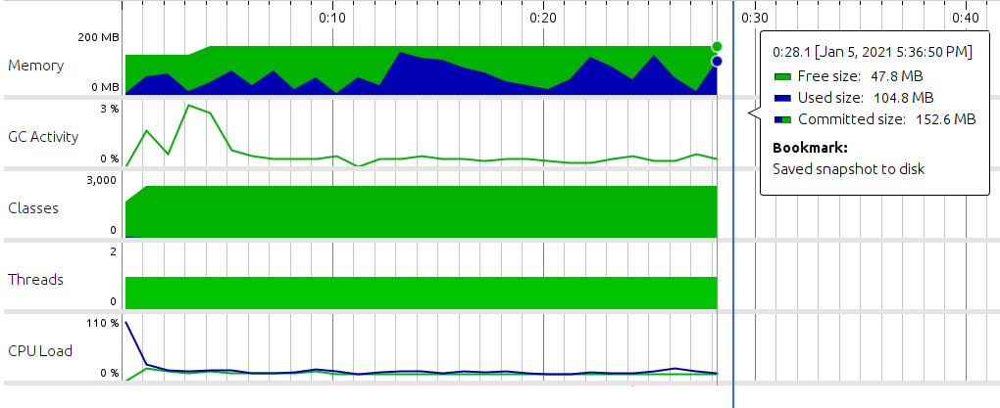
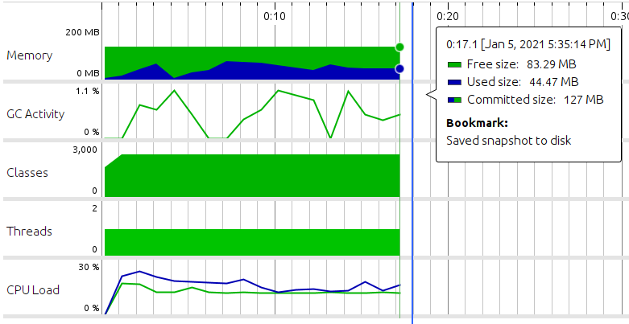
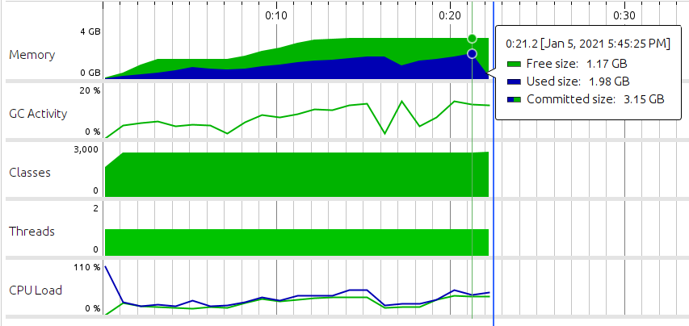
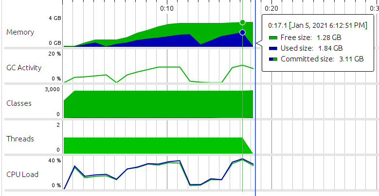

### GIF Decoding Library

[](https://search.maven.org/search?q=g:com.ibasco.gifreader) [](https://github.com/ribasco/gif-reader/actions/workflows/build.yml) [](https://github.com/ribasco/gif-reader/actions/workflows/release.yml)

A pure java implementation of the  [GIF89a specification](https://www.w3.org/Graphics/GIF/spec-gif89a.txt).

#### Motivation

After testing some GIF decoding libraries available (ImageIO, Apache Commons Imaging, DhyanB...) for Java, I found that there were still cases where some animated images were not processed or handled properly, resulting in deformation on the output image or simply returning in error (due to `OutOfMemoryError` or `ArrayIndexOutOfBoundsException`). This library was developed with the intention of addressing these issues.

#### Minimum JDK Version

JDK 11+

#### Limitations

- Android support is not possible at the moment since this library utilizes the `ImageInputStream` class provided by `javax.imageio` package.

#### Usage:

*Basic usage:*

~~~java
var file=new File("/home/user/example.gif");
try (var reader = new GifImageReader(file)) {
    while (reader.hasRemaining()) {
        GifFrame frame = reader.read();
        //note: Use frame.getData() to extract the raw image data (in INT ARGB format)   
        System.out.printf("Index: %d, Frame: %d x %d", frame.getIndex(), frame.getWidth(), frame.getHeight());
    }
}
~~~

*Using with JavaFX (Converting each frame to WritableImage)*

```java
var source=new File("/home/user/example.gif");

try(var reader=new GifImageReader(source)){
    int index=0;
    //scans the entire image and counts the number of frames available (optional)
    int totalFrames=reader.getTotalFrames();
    while(reader.hasRemaining()){
        var frame=reader.read();
        var frameImage=toFxImage(frame);
        //do what you wan with frameImage
    }
}

private static WritableImage toFxImage(GifFrame frame){
    //Method #1: Using Pixel Writer 
    //img.getPixelWriter().setPixels(0, 0, frame.getWidth(), frame.getHeight(), WritablePixelFormat.getIntArgbInstance(), pixels, 0, frame.getWidth());

    //Method #2: Using PixelBuffer    
    return new WritableImage(new PixelBuffer<>(frame.getWidth(),frame.getHeight(),IntBuffer.wrap(frame.getData()),WritablePixelFormat.getIntArgbPreInstance()));
}
```

*Using Block Filters*

Block filters allows you to inspect the current block being processed on-the-fly and provides you an option to skip it.

~~~java
var file=new File("/home/user/example.gif");
try(var reader=new GifImageReader(file)){
    var metadata=reader.getMetadata();
    //This block filter lets you skip the first image frame
    reader.setFilter(new GifImageReader.BlockFilter(){
        private int count=0;
        @Override
        public boolean filter(BlockIdentifier block,Object...data){
            if(Block.IMAGE_DATA_BLOCK.equals(block)){
                return count++==0;
            }
            //do not skip the rest
            return false;
        }
    });
    int frameCount=0;
    while(reader.hasRemaining()){
        var frame=reader.read();
        if(frame==null)
            continue;
        frameCount++;
    }
    System.out.println("Total frames processed: "+frameCount);
}
~~~

### Test results and Comparison

All images used in this test can be found at the [samples](https://github.com/ribasco/gif-reader/tree/master/samples) directory

**GifReader Test (GifReaderDemo.java)**

Note: A buffer overflow warning was shown below to indicate that the output data for the current frame was trimmed by the decoder instead of throwing an error. 

```text
====================================================
START
====================================================
Processed file: sample09-nsfw.gif (Total frames: 20)
Processed file: sample03.gif (Total frames: 49)
Processed file: sample05.gif (Total frames: 101)
Processed file: sample10-big.gif (Total frames: 3435)
Processed file: sample06.gif (Total frames: 10)
Processed file: sample11-big.gif (Total frames: 741)
Processed file: sample02.gif (Total frames: 61)
Processed file: sample04.gif (Total frames: 10)
Processed file: sample12-big-nsfw.gif (Total frames: 980)
17:36:51.326 [main] WARN  com.ibasco.image.gif.GifDecoder - Buffer overflow: There is not enough space to store 2 elements in the output buffer. Data will be trimmed (Remaining Bytes: 1)
17:36:51.341 [main] WARN  com.ibasco.image.gif.GifDecoder - Buffer overflow: There is not enough space to store 5 elements in the output buffer. Data will be trimmed (Remaining Bytes: 4)
Processed file: sample08-nsfw.gif (Total frames: 24)
Processed file: sample01.gif (Total frames: 30)
Processed file: sample07.gif (Total frames: 3)
====================================================
STATUS REPORT
====================================================
FILE: sample09-nsfw.gif         FRAMES: 20   , ERROR: None
FILE: sample03.gif              FRAMES: 49   , ERROR: None
FILE: sample05.gif              FRAMES: 101  , ERROR: None
FILE: sample10-big.gif          FRAMES: 3435 , ERROR: None
FILE: sample06.gif              FRAMES: 10   , ERROR: None
FILE: sample11-big.gif          FRAMES: 741  , ERROR: None
FILE: sample02.gif              FRAMES: 61   , ERROR: None
FILE: sample04.gif              FRAMES: 10   , ERROR: None
FILE: sample12-big-nsfw.gif     FRAMES: 980  , ERROR: None
FILE: sample08-nsfw.gif         FRAMES: 24   , ERROR: None
FILE: sample01.gif              FRAMES: 30   , ERROR: None
FILE: sample07.gif              FRAMES: 3    , ERROR: None
====================================================
END
====================================================
Processed a total of 5464 frames from 12 images (Took 27987 ms, Last File: sample07.gif)
```



**Javax ImageIO (ImageIODemo.java)**

```text
====================================================
START
====================================================
Processed file: sample09-nsfw.gif (Total frames: 9)
Processed file: sample03.gif (Total frames: 0)
Processed file: sample05.gif (Total frames: 0)
Processed file: sample10-big.gif (Total frames: 3435)
Processed file: sample06.gif (Total frames: 0)
Processed file: sample11-big.gif (Total frames: 741)
Processed file: sample02.gif (Total frames: 0)
Processed file: sample04.gif (Total frames: 0)
Processed file: sample12-big-nsfw.gif (Total frames: 980)
Processed file: sample08-nsfw.gif (Total frames: 24)
Processed file: sample01.gif (Total frames: 0)
Processed file: sample07.gif (Total frames: 3)
====================================================
STATUS REPORT
====================================================
FILE: sample09-nsfw.gif         FRAMES: 9    , ERROR: Index 4096 out of bounds for length 4096
FILE: sample03.gif              FRAMES: 0    , ERROR: Index 4096 out of bounds for length 4096
FILE: sample05.gif              FRAMES: 0    , ERROR: Index 4096 out of bounds for length 4096
FILE: sample10-big.gif          FRAMES: 3435 , ERROR: None
FILE: sample06.gif              FRAMES: 0    , ERROR: null
FILE: sample11-big.gif          FRAMES: 741  , ERROR: None
FILE: sample02.gif              FRAMES: 0    , ERROR: null
FILE: sample04.gif              FRAMES: 0    , ERROR: null
FILE: sample12-big-nsfw.gif     FRAMES: 980  , ERROR: None
FILE: sample08-nsfw.gif         FRAMES: 24   , ERROR: None
FILE: sample01.gif              FRAMES: 0    , ERROR: null
FILE: sample07.gif              FRAMES: 3    , ERROR: None
====================================================
END
====================================================
Processed a total of 5192 frames from 12 images (Took 17030 ms, Last File: sample07.gif)
```



**Apache Commons Imaging (ApacheImagingDemo.java)**

```text
====================================================
START
====================================================
Processed file: sample09-nsfw.gif (Total frames: 0)
Processed file: sample03.gif (Total frames: 49)
Processed file: sample05.gif (Total frames: 101)
Processed file: sample10-big.gif (Total frames: 3435)
Processed file: sample06.gif (Total frames: 10)
Processed file: sample11-big.gif (Total frames: 741)
Processed file: sample02.gif (Total frames: 61)
Processed file: sample04.gif (Total frames: 10)
Processed file: sample12-big-nsfw.gif (Total frames: 980)
Processed file: sample08-nsfw.gif (Total frames: 0)
Processed file: sample01.gif (Total frames: 30)
Processed file: sample07.gif (Total frames: 0)
====================================================
STATUS REPORT
====================================================
FILE: sample09-nsfw.gif         FRAMES: 0    , ERROR: Bad Code: -1 codes: 258 code_size: 9, table: 4096
FILE: sample03.gif              FRAMES: 49   , ERROR: None
FILE: sample05.gif              FRAMES: 101  , ERROR: None
FILE: sample10-big.gif          FRAMES: 3435 , ERROR: None
FILE: sample06.gif              FRAMES: 10   , ERROR: None
FILE: sample11-big.gif          FRAMES: 741  , ERROR: None
FILE: sample02.gif              FRAMES: 61   , ERROR: None
FILE: sample04.gif              FRAMES: 10   , ERROR: None
FILE: sample12-big-nsfw.gif     FRAMES: 980  , ERROR: None
FILE: sample08-nsfw.gif         FRAMES: 0    , ERROR: Bad Code: -1 codes: 66 code_size: 7, table: 4096
FILE: sample01.gif              FRAMES: 30   , ERROR: None
FILE: sample07.gif              FRAMES: 0    , ERROR: Bad Code: -1 codes: 258 code_size: 9, table: 4096
====================================================
END
====================================================
Processed a total of 5417 frames from 12 images (Took 19703 ms, Last File: sample07.gif)
```


**DhyanB's GifDecoder (DhyanBDemo.java)**

Encountered an `OutOfMemoryError` in first attempt. Failed at `sample12-big-nsfw.gif`

* First Attempt (OutOfMemoryError):

    ```text
    ====================================================
    START
    ====================================================
    Processed file: sample09-nsfw.gif (Total frames: 20)
    Processed file: sample03.gif (Total frames: 49)
    Processed file: sample05.gif (Total frames: 101)
    Processed file: sample10-big.gif (Total frames: 3435)
    Processed file: sample06.gif (Total frames: 10)
    Processed file: sample11-big.gif (Total frames: 741)
    Processed file: sample02.gif (Total frames: 61)
    Processed file: sample04.gif (Total frames: 10)
    Processed file: sample12-big-nsfw.gif (Total frames: 876)
    Processed a total of 5303 frames from 9 images (Took 23876 ms, Last File: sample12-big-nsfw.gif)
    Exception in thread "main" java.lang.OutOfMemoryError: Java heap space
        at com.ibasco.image.gif.demo.DhyanBGifDecoder$GifImage.decode(DhyanBGifDecoder.java:199)
        at com.ibasco.image.gif.demo.DhyanBGifDecoder$GifImage.drawFrame(DhyanBGifDecoder.java:274)
        at com.ibasco.image.gif.demo.DhyanBGifDecoder$GifImage.getFrame(DhyanBGifDecoder.java:366)
        at com.ibasco.image.gif.demo.DhyanBDemo.processImageFiles(DhyanBDemo.java:63)
        at com.ibasco.image.gif.demo.DhyanBDemo.main(DhyanBDemo.java:41)
    
    Process finished with exit code 1
    ```

    

* Second Attempt (Increased Heap):

    > Update max heap to 3GB `-Xmx3072m`

    ```text
    ====================================================
    START
    ====================================================
    Processed file: sample09-nsfw.gif (Total frames: 20)
    Processed file: sample03.gif (Total frames: 49)
    Processed file: sample05.gif (Total frames: 101)
    Processed file: sample10-big.gif (Total frames: 3435)
    Processed file: sample06.gif (Total frames: 10)
    Processed file: sample11-big.gif (Total frames: 741)
    Processed file: sample02.gif (Total frames: 61)
    Processed file: sample04.gif (Total frames: 10)
    Processed file: sample12-big-nsfw.gif (Total frames: 980)
    Processed file: sample08-nsfw.gif (Total frames: 24)
    Processed file: sample01.gif (Total frames: 30)
    Processed file: sample07.gif (Total frames: 3)
    ====================================================
    STATUS REPORT
    ====================================================
    FILE: sample09-nsfw.gif         FRAMES: 20   , ERROR: None
    FILE: sample03.gif              FRAMES: 49   , ERROR: None
    FILE: sample05.gif              FRAMES: 101  , ERROR: None
    FILE: sample10-big.gif          FRAMES: 3435 , ERROR: None
    FILE: sample06.gif              FRAMES: 10   , ERROR: None
    FILE: sample11-big.gif          FRAMES: 741  , ERROR: None
    FILE: sample02.gif              FRAMES: 61   , ERROR: None
    FILE: sample04.gif              FRAMES: 10   , ERROR: None
    FILE: sample12-big-nsfw.gif     FRAMES: 980  , ERROR: None
    FILE: sample08-nsfw.gif         FRAMES: 24   , ERROR: None
    FILE: sample01.gif              FRAMES: 30   , ERROR: None
    FILE: sample07.gif              FRAMES: 3    , ERROR: None
    ====================================================
    END
    ====================================================
    Processed a total of 5464 frames from 12 images (Took 21810 ms, Last File: sample07.gif)
    ```

    
  
**Kevin Weiner's GIFDecoder (KevWeinerDemo.java)**

* First Attempt (OutOfMemoryError):

  ```text
  ====================================================
  START
  ====================================================
  Processed file: sample09-nsfw.gif (Total frames: 20)
  Processed file: sample03.gif (Total frames: 49)
  Processed file: sample05.gif (Total frames: 101)
  Processed file: sample10-big.gif (Total frames: 3435)
  Processed file: sample06.gif (Total frames: 10)
  Processed file: sample11-big.gif (Total frames: 741)
  Processed file: sample02.gif (Total frames: 61)
  Processed file: sample04.gif (Total frames: 10)
  Processed file: sample12-big-nsfw.gif (Total frames: 0)
  Processed a total of 4427 frames from 9 images (Took 16848 ms, Last File: sample12-big-nsfw.gif)
  Exception in thread "main" java.lang.OutOfMemoryError: Java heap space
      at java.desktop/java.awt.image.DataBufferInt.<init>(DataBufferInt.java:75)
      at java.desktop/java.awt.image.Raster.createPackedRaster(Raster.java:467)
      at java.desktop/java.awt.image.DirectColorModel.createCompatibleWritableRaster(DirectColorModel.java:1032)
      at java.desktop/java.awt.image.BufferedImage.<init>(BufferedImage.java:351)
      at com.ibasco.image.gif.demo.KevWeinerGifDecoder.readImage(KevWeinerGifDecoder.java:703)
      at com.ibasco.image.gif.demo.KevWeinerGifDecoder.readContents(KevWeinerGifDecoder.java:582)
      at com.ibasco.image.gif.demo.KevWeinerGifDecoder.read(KevWeinerGifDecoder.java:307)
      at com.ibasco.image.gif.demo.KevWeinerDemo.processImageFiles(KevWeinerDemo.java:59)
      at com.ibasco.image.gif.demo.KevWeinerDemo.main(KevWeinerDemo.java:40)
  
  Process finished with exit code 1
  ```

  


* Second Attempt (Increased Heap):

  > Update max heap to 3GB `-Xmx3072m`

  ```text
  ====================================================
  START
  ====================================================
  Processed file: sample09-nsfw.gif (Total frames: 20)
  Processed file: sample03.gif (Total frames: 49)
  Processed file: sample05.gif (Total frames: 101)
  Processed file: sample10-big.gif (Total frames: 3435)
  Processed file: sample06.gif (Total frames: 10)
  Processed file: sample11-big.gif (Total frames: 741)
  Processed file: sample02.gif (Total frames: 61)
  Processed file: sample04.gif (Total frames: 10)
  Processed file: sample12-big-nsfw.gif (Total frames: 980)
  Processed file: sample08-nsfw.gif (Total frames: 24)
  Processed file: sample01.gif (Total frames: 30)
  Processed file: sample07.gif (Total frames: 3)
  ====================================================
  STATUS REPORT
  ====================================================
  FILE: sample09-nsfw.gif         FRAMES: 20   , ERROR: None
  FILE: sample03.gif              FRAMES: 49   , ERROR: None
  FILE: sample05.gif              FRAMES: 101  , ERROR: None
  FILE: sample10-big.gif          FRAMES: 3435 , ERROR: None
  FILE: sample06.gif              FRAMES: 10   , ERROR: None
  FILE: sample11-big.gif          FRAMES: 741  , ERROR: None
  FILE: sample02.gif              FRAMES: 61   , ERROR: None
  FILE: sample04.gif              FRAMES: 10   , ERROR: None
  FILE: sample12-big-nsfw.gif     FRAMES: 980  , ERROR: None
  FILE: sample08-nsfw.gif         FRAMES: 24   , ERROR: None
  FILE: sample01.gif              FRAMES: 30   , ERROR: None
  FILE: sample07.gif              FRAMES: 3    , ERROR: None
  ====================================================
  END
  ====================================================
  Processed a total of 5464 frames from 12 images (Took 17657 ms, Last File: sample07.gif)
  ```

  
